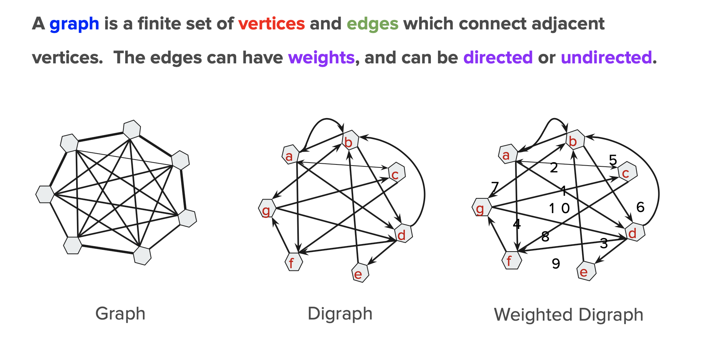
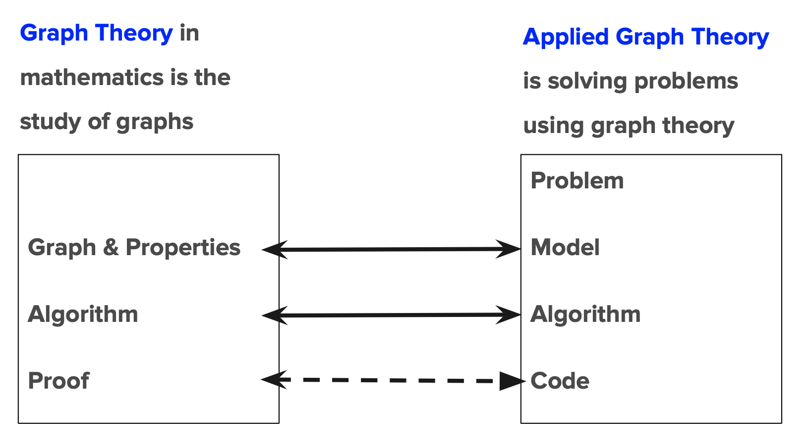
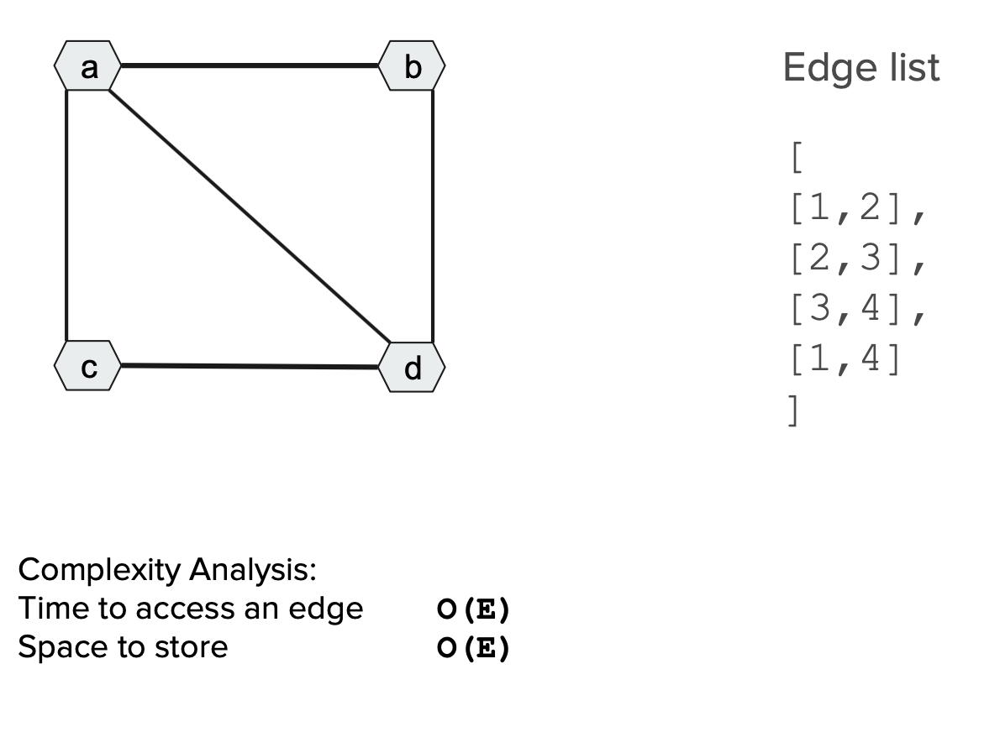
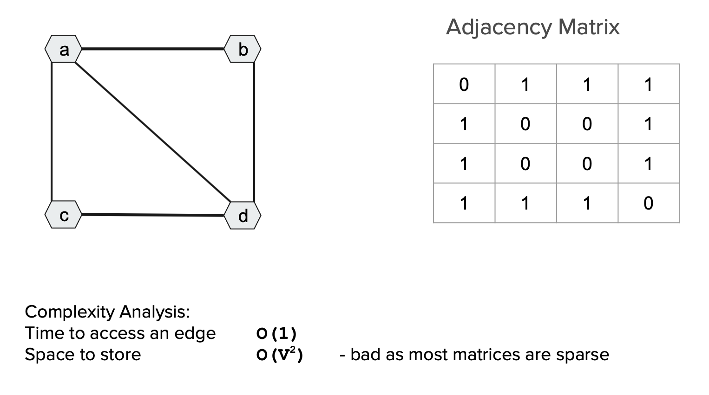
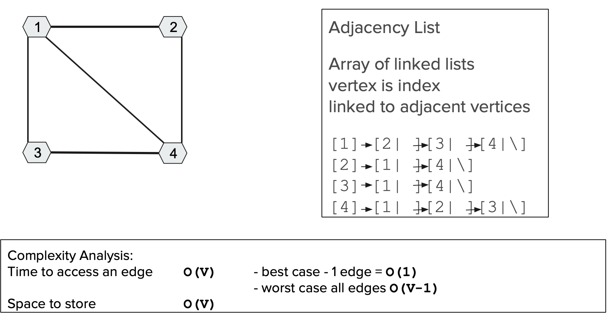

# Class 1
Slides ([link](https://docs.google.com/presentation/u/2/d/1eOGVRA2ziw9swgB1t0VXn2_gnIWl1sd-H5xglgSa3-E/copy?id=1eOGVRA2ziw9swgB1t0VXn2_gnIWl1sd-H5xglgSa3-E&copyCollaborators=false&copyComments=false&includeResolvedCommentsOnCopy=false&title=Copy%20of%2001.%20Intro%20to%20Graph%20Theory&token=AC4w5Vgylm0_Hd_sXOYbpOHW3hS5Jx8CsA%3A1562794766111&usp=slides_web))

Github ([link](https://github.com/Make-School-Courses/CS-2.2-Advanced-Recursion-and-Graphs/blob/master/Lessons/1.Intro-Graph-Theory.md))

# Graph Theory | Applied Graph Theory
 
 

 
 
 
 
 

1. Problems:
  * Chemistry
  * Physics
  * Computer Science
    * Data structures, Computer Hardware, Data Mining, Web Design, Network Systems, Information Retrieval, AI, Image Processing
  * Biology
    * DNA mapping
  * Electronics
    * Circuit Design
  * Operations Research
    * Minimum Path, Optimization, Scheduling
  And more (wikipedia / graph applications)
1. Model:  
  * Map the problem space to a graph - define vertices and edges
  * Map the solution to a graph property
  * Choose an algorithm to find the graph property
1. Implementation of Algorithms in Code:
  * Data structure to represent graph
  * Coding implementation methods - iterative, recursion, advanced recursion

# Homework
* Challenge 1: Create ADT graph ([link](https://github.com/Make-School-Courses/CS-2.2-Advanced-Recursion-and-Graphs/blob/master/Challenges/Challenges.md#challenge-1))

* Implement the Graph ADT with an adjacency list
* Implement code to read in a graph from a text file to create an instance of the Graph ADT and use it's methods.

**Input**: A graph file (can contain a directed or undirected graph with or without weights)

**Output**:
* The # vertices in the graph.
* The # edges in the graph.
* A list of the edges with their weights (if weighted)

**Stretch Challenges 1**
* Re-implement the Graph ADT using one of the python collections ([link](https://docs.python.org/3.6/library/collections.html#module-collections))
